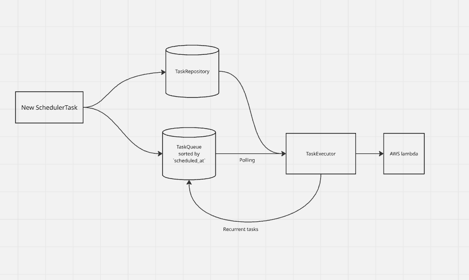

# Scheduler

Kotlin library for scheduling and executing AWS Lambda jobs with one-time and recurrent schedules



## Features
- Create an AWS Lambda function on the fly and schedule its execution
- One-shot and recurring schedules (fixed interval)
- In-memory task repository with simple querying and cancellation
- Virtual-thread based execution
- Example Spring Boot app and a Dockerfile to try it quickly

## Roadmap
- Persistent task store (Postgres) so tasks survive restarts, scale across instances, and recover safely.
- Error correction: retry on failure, retry with exponential backoff, circuit breaker, maybe dead letter queue
- Write through cache, cache contains tasks ready to be executed in the nearest future (configurable).
- Richer scheduling and delivery guarantees: cron/time zones, idempotency and concurrency caps.
- Production-grade observability and operations: structured logs, metrics and tracing, health/readiness probes, dashboards and alerts.
- Dynamically scale tasks dispatcher (based on load)

Notes:
- The scheduler runs a background loop on virtual threads and will keep the process alive.
- The environment variable `AWS_LAMBDA_ROLE_ARN` must be set and point to a role with permissions to create, update, and invoke Lambda.

## Demo application (Spring Boot)
An example app under `example-app` exposes simple HTTP endpoints.

Endpoints:
- POST `/schedule`
  - Body (JSON):
    ```json
    { "name": "demo-lambda", "jsonPayload": "{\"hello\":\"world\"}" }
    ```
  - Creates a tiny Node.js 20 Lambda from an in-memory ZIP, deploys it, and schedules a single execution.
- GET `/list` — returns all tasks in the in-memory repository
- GET `/result/{name}` — returns all tasks by Lambda name (with status/result)
- POST `/cancel/{name}` — returns all tasks by Lambda name (with status/result)


## Run with Docker

Build container:
```bash
docker build -t example-app -f .\Dockerfile .
```

Run container:
```bash
docker run --rm -p 8080:8080 \
  -e AWS_ACCESS_KEY_ID= \
  -e AWS_SECRET_ACCESS_KEY= \
  -e AWS_REGION=eu-north-1 \
  -e AWS_LAMBDA_ROLE_ARN=arn:aws:iam::<account-id>:role/<role-name> \
  scheduler-example
```

Then:
```bash
curl -X POST http://localhost:8080/schedule \
  -H "Content-Type: application/json" \
  -d '{"name":"demo-lambda","jsonPayload":"{\\"hello\\":\\"world\\"}"}'

curl http://localhost:8080/list
```
## Troubleshooting
- Error: `AWS_LAMBDA_ROLE_ARN not set` — export the variable to point to a valid IAM role ARN
- Error: `Function <name> never became active` — the role may lack permissions or you're using a wrong region
- Empty results — check region/credentials and that the function name matches the scheduled tasks
